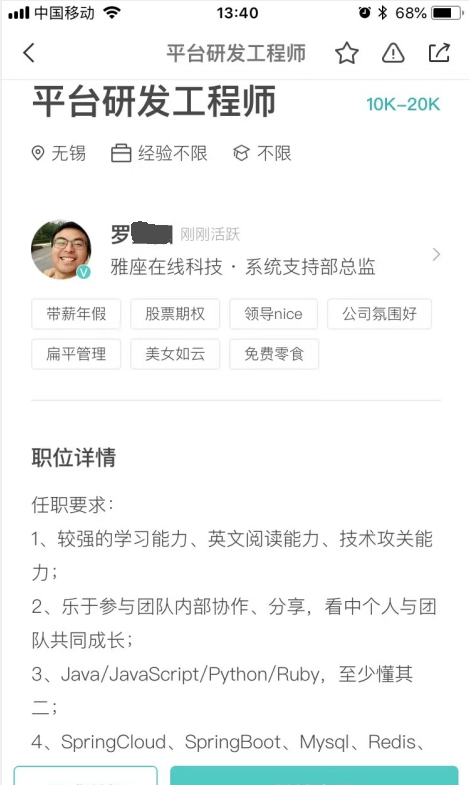
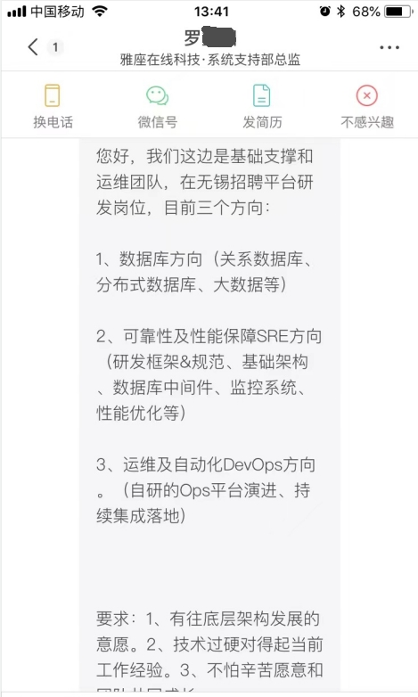

# 2013 23岁
这是在无锡职业技术学院的第三年,也是最后一年,即将要毕业踏入职场 踏入社会,回想这三年,完全就是恍恍惚惚 浑浑噩噩,没有目标的过着,每天都是英雄联盟,我当时不知道原来自己就是那种安分守己的,当时想只要有一份工作就行
没想到后来因为别人(我妈认识的一个朋友的儿子)的推荐,去了健鼎,在实习的时候干了2个月,后来因为要2班倒(这中间经历了一段很长的时间,我当时回宿舍鞋都没换,也不知道什么时候鞋里有两个挺小的小石子,我印象里我应该是2个月都没脱过鞋,
能很明显的感觉到脚掌靠近脚趾的部门很疼,结果后来偶然把鞋脱了,就直接看到两个石子嵌入已经磨出很厚很厚的茧里,后来把两个石子扣了出来,但是那么厚的茧,走路都感觉膈应的慌,这个茧知道16年才想办法去掉),结果在夜班的时候没熬住睡了,
被抓住了,直接就被开了,后来幸好跟部门老大还有联系,所以在回到学校之后,当时就想着 通过他再返厂,回到学校之后,当时宿舍只剩下*郑鑫*和*石少波*,我们三个在宿舍待了一段时间,后来郑鑫走了,就剩我和石少波还有隔壁班的几个统一搬宿舍,
当时想的是等我毕业之后就去健鼎,所以反而没有什么后顾之忧,就想着会有工作,所以几乎就是每天打***英雄联盟***,直到通知我去入职健鼎,等真的到了健鼎,也看到新来了一批人,由于不需要在从头开始,所以没过多久就安排去学习使用cam软件,
到专门的会议室,每天过去学,当时那一批有不少人印象比较深的有*郭佳宗**徐燕伟*等,当然还有波哥和他们芙蓉厂的人,之间相处的还是挺好的,学完之后回到原来的办公区上班,其实我也不知道从什么时候开始我就意识到一个问题,这不是我想从事的,
当时工作用的是sun的spark服务器,电脑上的操作系统是solaris,在上面可以输入命令执行,太像linux,也不知道为什么我慢慢地有自己的想法了,慢慢地有了一些想要去做一些能带来更好变化的想法,我(和在同一个宿舍睡我下铺的'舍友'*赵涛*一起)
从书店买了两本书一本《从零开始学C语言》,另外一本是跟嵌入式相关的尤其是当我看到最后关于用C语言通过结构体+指针实现一个链表的时候,我能够在脑海里确实把他能复现出来的时候,当时还是挺激动的,也是那个时候我心理确定了要走这个方向,
工作的电脑上的操作系统让我也觉得这个方向要学习的东西很多,终于在完成了一个cam的制作之后,我毅然跟当时的领导*苏峰*提了离职,其实想起我实习的时候我爷爷躺在医院里,当时他批准了我的请假,我还是挺感激他的,离职完了之后,
我搬去了波哥他们住的地方(云林苑),在那边已经不知道待了多久,之前拖波哥买的《C和指针》《鸟哥的Linux私房菜》还有一本是嵌入式ARM相关的,还专门卖了一个嵌入式板子,后面是专心把C和指针看完(尤其是到后面的复杂指针声明,
还有别名 还是觉得挺有成就感),然后就是学linux,前面学了很多理论知识,再到后面就是一大堆命令和vi工具的使用,除了一些基础的命令,印象比较深的就是grep和正则的搭配使用了,再后来要搬离住的地方,这有一个小插曲(这一年过年没有回去),
新的地方还是在云林苑,但是是在顶楼的阁楼,当时分配的时候还是挺挤的,接着就是2014年了
# 2014 24岁
这一年应该说还是比较平坦的,继续学习,中间因为钱的关系,还被网上兼职的诈骗了(骗了2000多元,也是那晚波哥刚下班接到母亲的电话,结果打着打着就哭了),还差点拉波哥下水,后来意识到这样下去不行,还是得先找个兼职得工作,
所以就在网上搜,被一个叫达内的通知去面试,我当时还是挺疑惑的,我看它是一个培训机构,面试我过去是干什么呢,我将信将疑地过去面试,好吧,原来是忽悠我来培训,确实她说的很有道理,(后来想了想还是培训吧,办理培训还把身份证给丢她那里,回老家重新办理了身份证),
确定去他们那里培训之后就离开了波哥他们,到培训机构附近租了一个小单间(润泽雅居),中间还发生了一个小插曲,培训机构因为要给我弄一个边工作边学习的机会,所以给我找了一份工作,就是电话销售,地点就在旺庄科技创业中心大楼,面试的时候,看到前一个面试的,
我以为是男的在面试女的(因为男的面无表情,很高冷),轮到我的时候才知道女的才是面试官,然后劈里啪啦说了很多,然后就让我入职了,后面入职了,我的心思也不在打电话销售上,刚开始还好,先让我熟悉熟悉,就在我工作的电脑上下载了C语言的编译器(编辑器)(lcc-win32)也是《从零开始学C语言》这本书里介绍的,
然后可以自己去巩固学的知识,但是因为位置就在会议室外面,所以在会议室里的人都能看到我的电脑屏幕,(后来我才知道他们有些人都知道那几天我在干什么),后面几天说让我选择一个组,不同的组要参与的销售内容不一样,让我考虑考虑,后来安排我坐在一个跟我差不多大
男生对面,我得开始打电话销售了,给了我一个电话号码记录,按照那个一个一个打电话,推销一些产品和商品,我印象最深得是给一个大叔打电话,我热情给他介绍,他也是心平气和地跟我说,未来的事没人会知道的,你也不知道你未来会怎么样的,我也不知道未来会怎么样,反正
说的我也哑口无言,后来就挂了,说真的当时感触还是挺深的,原来以前的类似的骚扰电话就是像当时的那样的我这样的人打的,后来跟我对面的人聊了,我也是表达了我想走技术这条路,他告诉我他之前也是做开发的,然后在哪个哪个公司,里面都是大牛,他就是觉得太累了,所以
转到这边做销售了,我对他的话半信半疑吧,但是并没有对我的想法有多少影响,更多的是一种更加认清吧,当时有一个大学隔壁班的曹斌就在附近上班,他就是从事的单片机相关的工作,那时中午还一起吃饭,他还有一个妹子(双下巴)但是属于还挺好看的,我以为她是曹斌的女朋友,
也忘了聊了啥了,可能是我也跟他们表达了我要从事软件开发的想法吧,后面还被电话销售部的老大单独叫到办公室里聊,也就是见招拆招吧,里面的人也就是平常能看到的那种,有一个女生还是有纹身的,每天还有早会,给每个人分析和回顾,后面正式要开始电话销售了,
心里面还是挺纠结的,最后下定决心离开吧,在这干下去我得精神分裂,所以就提离职,工资这块是真的不容易啊,还是一直跟另一个小伙伴联系要的,最后也就是拿到手才100多块钱,想着我入职这家电话销售公司的时候因为要喝水,所以就在对面小卖部买了一个茶杯(雀巢,到现在还留着),
我现在还在想他们也不在意他们在我心理的印象,可能我在他们的心理才是属于傻逼的那种,后面我就打算自己找一个兼职,然后在附近的(宝龙广场)的顺旺基找了一份兼职(半天工),店长人还是挺好的,我也都一五一十地跟她说清楚,她才同意在这边兼职,
在那里认识很多阿姨(有一个阿姨人真的很好)和几个有趣的姐姐妹妹(还有其它高中刚毕业兼职的弟弟,有一个对海贼王也是很有研究,猜中了贝加庞克吃了脑脑果实),我就记得有一次整店都要大扫除,然后我负责擦2楼到1楼的楼梯,当时不知道为啥就唱起了歌(陈小春《没那种命》),
平常最忙的时候就是中午,帮忙打菜,帮忙打饭,帮忙收拾客人吃完的碗和盘子,然后再把一满框的碗送到楼上回收,有的时候饭不够了,去二楼和大叔一起把饭抬下来,后面有时候还要兼职凌晨的早餐工作,早上5点必须到,然后就是把各种甜点早餐给送下来,收拾盘子和碗,在这边打工兼职的好处,
就是可以省下饭钱,我记得最清楚的一次也是因为疏忽,同一个人,因为收拾盘子习惯了,没注意是客人吃完还是他有别的其它事,所以当时看到盘子就想去收,当时幸好另一个姐姐提醒了我,但还是被那个客人发现了,感觉是吃了火药了,一个劲的朝我输出,骂的话不说多难听,但也好听不到哪儿去
就是揍死我,说服务员要好好培训,本来我还是挺觉得歉意的,但是看他得理不饶人,我也就跟他反驳"我不知道",但是他还是不依不饶的,我也就没搭理他,其实心理真的想着要努力啊,不能被这种人给辱骂了,也算是真正被社会大学上了一课,就是你会遇到很多种人,不是所有人都是会释放善意的
店长人真的很好(可惜后来就没见到了),中间还见证了世界杯半决赛德国7:1巴西,另外半天就去培训机构看录播视频,后来发现经济上还是没能承受地住,后来就跟父母坦白了,爸妈之后后还是表示支持给我打了钱(感谢他们),有了钱之后就不再
去顺旺基继续打工了,专心去培训机构学习,实时学习,当时那一班学的人还是挺多的,认识了坐我旁边的*高炯*和坐我前面的*肖立成*,他们学历都很高,高炯年纪已经是30多了,肖立成是江大毕业的(但也属于跟我一样基本没戏,打游戏),
我们有时候还是会一起讨论,中间有过一段时间我没去学(它那边是要每天都要报导),去附近的网吧通宵玩游戏(*英雄联盟* 我印象比较深,网吧里有个很大的老鼠,上蹿下跳,直接把我吓尿了还有我玩拉克丝(辅助/中单)20连胜),之后就是再回去培训机
构就是前端的学习,框架的学习,再到后面就业指导,也就意味着临近找工作了,因为临近过年了,我也确实得做好充实得准备
# 2015 25岁
过完年之后就是投递简历,我现在发现这个时候的我还是井底之蛙,乃至于之后依然是格局太小,想的太多,我记得面的第一家是几个人一起去的再微纳园里的日企外包的公司,一同去的最后就我被录用了,后面还和*徐文安*(也是一起学习的同学)一起去太湖云计算面试,已经
不记得我当时紧不紧张了,反正就是会就多说一点,不会就少说一点,一面是我后面的leader(陈峰),二面应该是公司层面的领导面的,面试完之后谈期望薪资,这可能是我最心愧的时候,我说了3500,最后确实给我发了offer,也是这个薪资,因为找到
了工作,并且还提供了住宿,所以悬着的心也放下了,宿舍里认识了*胡林杰*,还有另一个做ios新来的同事(名字已经忘了),刚开始没安排什么工作,我坐在那个工位,也认识了一个高手*吴叶俊*,后面被分配到优先级更高的HTC项目去了,结识了公司的
架构大佬*鲁杨*,我们三个前期还要去上海的HTC总部,讨论需求和方案,我当时非常非常拘谨,话也不敢太说,就算是玩笑也不敢去接,毕竟是第一份工作的第一次出差,在客户现场我还主动倒水给他们,然后被鲁大师说了一下(去忙自己的工作),我清晰
记得我写了一个`if(str == null)`的代码被他看到了,他还嘲讽了一句"你都是这么对字符串判空的吗",当时别提多尴尬了,在上海待了2/3天,就回去了,然后很多东西也不懂,我就记得在最下层的会议室了,给我安排了一个增删改查的功能,我琢磨了半天,
没有写出来,大师还是比较急的,自己封装除了一个方法,让我去实现这个方法,后面又出了一次差,那次是应该是讨论跟其它第三方调用的问题解决,也看到台湾人的企业的管理(远程会议上会直接揪错误),后面也是讨论处理方案,然后写代码解决,回来之后
公司来了一个实习生(一个女生,忘了名字了),交给鲁杨了,鲁大师也说新手自己没法带,就让我去带,我跟她讲了很多关于java语言方面的东西吧,她还挺崇拜的,后来她走了之后就没再联系,她好像说要回老家发展,后面又重新开发HTC项目(中间发生了一个
小插曲,大师派给我一个任务,我没能实现,气的大师,拍他的电脑给我看,"我怎么能实现的",当时确实是我的问题,我对那个前端的工具真心不了解),后面就是基本的开发工作,中间买了三本书《Spring实战(4版)》《jQuery实战(2版)》《javascript权威指南(5版)》
Spring实战是看的比较详细,补充了很多我对Spring使用上的知识,jQuery实战丰富了我在前端的操作,javascript权威指南太厚,基础了看了一些,剩下的一直没看,后面也不知道为什么买了一本算法书《算法(4版)》,也就前面的基础内容看了看
后面实现是没时间看了(主要还厚),后面HTC一期的项目昨晚交付之后(有一个小插曲,项目是晚上部署的,然后当时因为要迁移数据,所以会把数据库的数据复制一份到生产库,我当时也忘了要写sql实现一个删除逻辑,但是没有写条件,导致整个表都给删了
还好大师也没太责怪我,只是让我去洗个脸,内疚的是让另一个已经回家的同事又来了一趟公司,太惭愧了),HTC项目一期结束之后,我们四个还去附近的一家饭馆吃了一顿饭(每个项目结束好像都有一次聚餐),当时还是觉得挺尬的,问我哪儿人,问我为什么干这行吧,我基本上没怎么说话,
中间国庆节的时候去云南昆明参加*李昱旻*的婚礼,飞机票还是让超哥帮忙买的,去的时候是波音的,回来的是空客的,反正价格差的还挺多的,那是我第一次坐飞机,很离谱我在我书包里放着一本《javascript高级程序设计》,现在想想真的很离谱,下飞机的那会儿能很明显的感受到耳鸣,
耳鼓很疼,到了昆明,*李昱旻*已经到了机场迎接了,大家一起坐上他的马自达,一路开到他在一个学校里的家,整个路上我没怎么说话,还是想的多,还是顾虑的多就感觉毕业了1年多了,似乎发生了很多事,但其实也没发生什么事,在工作群里还能看到公司里的人发的信息,还有人打电话找我,
我肯定是没空的,到了*李昱旻*家,也是各种帮忙,具体也忘了,*李昱旻*也是安排了住的酒店,我跟超哥一起,波哥和*郑鑫*一起(蔡哥忘了为啥没来),当天晚上*李昱旻*带我们在附近一个比较隐蔽偏僻的小巷子里的一家店吃饭,说很好吃,具体我已经忘了吃的啥了,吃完也是跟着他们一起回去,
他有一个做飞行员的朋友,还是挺活泼、逗比的,第二天又去*李昱旻*家,然后中午是在家附近的一个饭店吃了顿饭(也有不少桌),跟*李昱旻*小学、初中、高中的朋友们一桌,我说的也很少,好像有一个是文科专业的,然后就拿波哥懂诗词歌赋开玩笑,后面具体有没有再深入的聊,就不记得了,反正我没怎么说话
也是尬聊,然后就是晚上才是去酒店(本来吃完饭之后就安排我们过去酒店了,我们几个就在酒店里面逛,还提前给每个人录了祝福视频),当时*李昱旻*也得各种招呼,后来到了傍晚,基本上开始入席了,我们也就从正门进去,然后给红包,然后入座,当时安排的就是跟他小学同学一桌,波哥还是
挺主动的,主动聊,主动递烟(对于他们的描述,波哥挺一阵见血,混艺术圈的朋友),后面到婚礼仪式环节,因为坐的位置的关系,看的视角不是很清晰,但是能感觉到整体的布置和环境的搭配,应该是要不少钱的,而且没仔细看,也有挺多桌的,仪式结束过了挺久,李昱旻和他媳妇来到我们这桌敬酒,
也就随便喝喝,但是心意都在,后面他们都去KTV了,我还是因为坐飞机导致的那种晕眩感还在,所以就没去了(其实还是那种想的太多,顾虑的太多,导致压根就放不开也是原因之一,而且这个是我当时都没意识到的,会被别人说是内向,害羞),后面*李昱旻*跟我说,好多当初在学校里一起玩
游戏的都来了,都还记得我,我还是挺诧异的,第二天,根据他们的描述,昨晚玩的还是挺疯的,还拍了视频和招聘,具体没看,因为我们四个即将不如旅游的行程,第一站就是去大理,后面还有去丽江,在路上还结实了另外几个女生一出来旅游的,也是*郑鑫*这种搭讪的能力的体现吧,一起在大理的一个古镇
在一家饭店一起吃饭,饭桌上各种闲聊,我也是没怎么说话,介绍到我的时候,也是各种调侃我,说我带了一本很厚的书来看,那些女生都觉得不可思议,我也只是笑笑地掩饰我的尴尬,因为是报的旅行团,而且是价格比较低的,所以后面必然要去很多卖场性质的场所,去的第一个地方忘了是哪里,
反正上车的时候那个导游看到我们都是两手空空的,还是很委屈地说了很多他们怎么不容易,后面甚至哭了,我也是心比较软,后来到了一个银器商城,全部都是银造收拾,什么雪花银,当时进来的时候导游就已经在劝大家尽量买点,我心理还是很有点过意不去的,又想到了我妈,所以就决定买个带回去
给我妈的,选了半天选了个镯子,还是现场打造,花了2000多,我知道肯定是不值这个价,也算是这次出来旅游的给我妈带的礼物,其实说实话,我心理压根没想过买东西的,也就是这次被这个导游给激的,后面还去了玉龙雪山(只是远观),观看了一场大型演出,那太阳晒的,真的是受不了,后面还去了
丽江古镇,逛了一条很长的街,就是当地的服装的人各种展示文化、乐器、工具、饰品,挺眼花缭乱的,也就这么逛着,我还记得在一个牦牛肉的卖点有一个试吃的,我当着波哥的面多吃了几次,被他鄙视地,我当时确实脑子有点抽了,后面就是去那种酒吧街,我对这种文化本身就不是很感冒,
所以也就是转转,最后回酒店休息了,最后旅程完结的最后一顿饭,大家在吃的时候,有一个主持人介绍一个手写毛笔字的大师,曾经上过cctv,怎么怎么牛逼,然后现场表演,纯用手在纸上写字,还是有几个人跑上去买他的那些字,还说以后会升值,有一个我们团的大姐,还挺兴奋地买了他的字,
后面就是回昆明了,*李昱旻*带我们去了一个石林,他说他也是第一次来,具体流程已经忘了,回来之后还去网吧开了黑,他一个朋友还站在我后面看我们玩,后面晚上跟他的一群好朋友在酒吧各种玩各种喝酒,第二天中午又约着在一家店吃饭,吃完之后大家一起规划着,最后毅然决然地还是选择了网吧,
当时忘了有几个人了,去网吧开黑玩,晚上也是去酒吧里,然后这次就喝的比较多了,玩的游戏也是五花八门的,我跟超哥、波哥应该是中圈套最多的,后面波哥喝的在*李昱旻*家门口直接吐了,我也是借着酒劲跟他一个朋友说如果他弟也要学软件我能帮到的一定帮忙,到*李昱旻*家之后就在沙发上直接睡了,
因为明天就要回去了,第二天一大早被*李昱旻*叫醒了,在附近吃了云南特色的早餐,就开车送我们去机场了,我困的不行,已经记不清一路上说了什么,看到了什么,到了机场也醒的差不多了,就在机场门口道别了,约着以后还要再来云南,还要再来昆明,于是我们四个坐上回程的飞机回去了,回去的飞机的质量明显比不上来的,整个旅程就结束了,
回来之后上班就一直在公司三楼,中间还认识了*罗威*(也是一个很强势的人,但是跟鲁大师很熟),接着就被派到新的项目去了,歌莉娅全渠道,这个项目领导也很重视,所以投入了很多人,也认识了3个新入职的人,包括*黄亮*_卢茂琳_*李根*,然后在*翟俊奇*的讲解下了解了开发的框架和代码的结构,
然后就是很多人都拥挤在一个大的会议室里讨论,公司还给买了零食,那会儿大家还是其乐融融地,因为投入的人比较多,所以跟客户讨论方案和业务的都是我们这边派的代表(姓陈,后面去邦道的时候也碰到他了),整体开发的过程还算可以,我 黄亮 李根被分到了鲁杨那一组,
是负责商品价格那一部分,中间李根因为粗心和鲁杨好说话,多次提交的东西都是有问题的,甚至鲁杨还当着大家的面说他(不要每次都让我给你擦屁股)后面就是正常的开发,鲁大师会负责安排任务,我们去开发,说实话并没有直接去认识项目里的框架部分,中间有一次歌莉娅全团队去一个商场里的高级日本料理店消费,只记得场景,但是不记得是
什么料理了,那个时候每个小组还安排了一个小姐姐做项目开发记录统计,有一个小姐姐还挺文静挺漂亮的,还有一个是*张文峰*(后面去路通智能又再一次相见)的现任女朋友 在妆造上确实是花了功夫,项目一直开发到了年底,还在维护,年会还获得了一个小奖(挺后悔没有去给鲁杨敬酒的),
> 这一年还遇到了来无锡江南大学继续深造的高中同学**赵雪丽**,说实话我对她还是有种异样的感觉
>> 高一的时候她在一班跟我从小玩到大的伙伴**李麓华**一个班,第一次看到她确实会有心动的感觉,后来偶尔也会在一班路过我们班门口的时候特别注意她吧
>> 后来高二的时候要文理科分班,没想到她分到跟我一起的6班,而且在后来的换位置的过程中,她被安排在了我的左前方,其实怎么说呢,那个时候是挺克制自己的,整个高中的相处还是挺融洽的,没有什么出格的事情,主要是我主观的克制,加上复杂而又不合理的情绪管理和精力
>> 管理也就这么过去了,高中毕业之后我想尽办法获取她的联系方式,直到大一的时候,终于拿到了她的QQ,那时还是很激动的,知道了后来她复读了,并且她说她还是更喜欢复读的那些一起学习的伙伴,再后来李麓华要做手术住院了,我跟她讲了,她还是很热心要去医院看望
>> 李麓华,一次跟她语音通话的时候我还是很紧张的,记得很清楚,她在跟我通话的时候不说话了,原来是她在进电梯的时候,手机不小心掉地上了,(可能是我的遗憾吧,那个时候不坚定,不清醒,拧巴,别扭),后来李麓华还跟我说了这个事情还挺诧异的,后面我也跟他表达了我对她有
>> 想法这个事情,他还挺鼓励我的,但是在我跟她聊天的过程当中,她提到了她的男朋友的时候,真的是晴天霹雳,那晚我几乎没有睡,还发了一个qq空间,后面也只是偶尔联系
> 
> 话说回来,这次她来无锡在江南大学继续学习还是挺让我意外的,我鼓足勇气约她见面,并在江大南门的一个饭店请她吃饭,也就是聊以前高中的往事,聊她之后的经历吧,还有我的经历,中间我妈还给我打了电话,已经不记得那顿饭的整体过程了,总之还算愉快,总之遗憾吧,但人生还得
> 继续不是嘛,到现在也是,继续学习,继续探索未知
# 2016 26岁
过完年之后就换了新的办公地点,继续维护新的项目,那时候整个办公室讨论的最大的事情应该就是房价上涨,尤其是上海,基本是翻了至少一倍,当时很多人哭诉,辛苦工作一辈子,不如买房一夜涨的价值,后面也影响到无锡这边,反正后续因为苏州的炒房,无锡这边的房价也是涨的很厉害,
但是因为当时我压根就没有买房的意愿和想法,也就是当个新闻听听,那个时候因为新的办公室就在销售办公室隔壁,销售的声音还是挺大的,能听到他们在讨论很多事情,因为我之前就了解黄亮的薪资,所以心里还是挺不平衡的(所以说每个人都是又缺点的,哪怕是性格上的)
所以年后我尝试了去外面面试,具体的已经记不住了,零星记得去过滨湖区的530大厦面试过,面试过程已经忘了,反正跟我说公司年会给老员工发了金链子,我当时还觉得挺搞笑的,还有去了一个很明显是外包公司,并且周末还在加班,因为我就是在周末面的试,还有面试题要做(难度不是很大),
还有在新吴区530创业大厦面的一家公司,我依稀记得那个面试官还挺吊(高冷),也不甩你,我感觉对于数据库事务那块说的不好,一个原子性概念解释了半天,最后就是在滨湖区的联创大厦面试的蓝卓科技,就是在写字楼里,那个时候太想换一份工作了,面试过程整体来说还很顺利,
面完之后我去*肖立成*租的地方去找他玩,聊了会儿,跟他合租的同学养了一个猫,还怕它跑出去,后面没过多久蓝卓就通知我入职了,所以我立马就找陈峰(在组织架构上他属于我的上级),跟他聊离职的事情,他一开始还挺惊讶的,他让我等他这边跟上面的人沟通,其实那时候我也不是很确定
我是要走还是留,就是有点随意的感觉,看大家走的人挺多的,也想着要不就走吧,直到陈峰再把我叫出去,问我的期望薪资的时候,当他跟我沟通甚至把鲁杨都拿出来说,说在这边的前途等,我当时都没怎么听进去,还只是觉得钱没给够,觉得自己的能力不值这个薪资吧,所以后面陈峰也没留我,
去年我电脑在宿舍还摔坏了,新换了一个华硕的电脑,后面就入职了蓝卓科技,就在蓝卓科技旁边有一个小区叫鸿桥苑,还是找的第一个房东介绍的,整个屋子三室一厅,考虑到价格最后选择了不带卫生间的次卧,那个时候我旁边的房间已经租了一对情侣,男的还挺老实的,那个时候,
当时想着要晒衣服,所以在网上买了钢丝线,专门到楼下找两棵树用线绕起来,然后晒被子,被套、床单都是妈给整理好的,那个时候还是一门心思的学习,又相继买了不少书,最重要的应该就是《java8实战》这本书了(后面这本书送给了*浦静*,也是有缘人),这本书看的我也是收获很多,除了
对lambda表达式还有stream api等使用,最惊喜的要属于后面对于函数式编程的介绍了,还有一本书《图解设计模式》,这本书给我带来的视野上的改变更多,真的是让我重新认识了面向对象的理念,读完之后就是有种醍醐灌顶的感觉,也让我在以后的开发当中能够主动地去从面向对象的角度考虑问题,
能够在开发的时候根据已知的业务逻辑反推出内在的业务结构,甚至可以挖掘出更深层的业务深度,让你在开发的时候就不是一股脑地去写逻辑,而是要考虑代码结构来蓝卓开发后面还认识了后来入职的android开发*刘高鑫*(江大毕业的),其实我不懂如何去辨别公司,感觉就是薪资给够我就干的想法,现在来看这种公司应该是会谨慎又谨慎,
里面有算是部门老大老王(名字暂时忘了),老华(*华明祺*),磊哥(*张磊*),还有三哥(名字暂时忘了),ios开发(*朝鲁门*(江大毕业的,老家好像是新疆的)),还有新招的2个测试(男生叫*鞠啸*,女生名字忘了记得也是江大的),还有产品(*张艾燕*,*王伟*,*张雪瑾*,*华骏伟*)*张艾燕*燕姐人真的挺好的,约我单独去办公室里聊,还开导我,
还挺感谢她的,UI(名字是真忘了),还有一个应该是市场的(*杨已思*)以及hr(*贾真*),还有坐我面前的运维(感觉很牛逼,运用的是自动化部署),以及新招的另外的研发(*张浩*人挺老实的也是江大毕业的,*张梓阳*人有点飘但人还好,有一个是研发老大的亲戚*陈凯*),整个办公室的氛围还是挺好的,经常闲聊,我当时就是很拘谨(现在慢慢知道原因,但是当时就是属于没想开),
后面就是常规的开发任务,隔壁公司不记得是什么公司,后来搬走了,又来了一个新公司,但是属于是把玻璃给封起来的,看不见里面在干什么,后面在厕所门口偶尔能看到他们在哪里聊天抽烟,后来好像是贾真说的他们可能是传销诈骗公司,当时觉得还是有点慌的,那个时候回家就是点外卖,我记得点了好多次烤鸭,直接给吃胖了不少,反正也没省什么钱,
后面专门去网上买去茧的药,(因为之前都是用刀片慢慢地把茧给削掉,但是过不了几天,那个茧还是会厚起来)所以就想着在网上买药,效果还是挺明显的,后面慢慢就好多了,中间还经历过智齿驻了(怪自己连续好多天没去刷牙),去第九人民医院拔牙(总共去了2次,第一次是牙疼的厉害去会诊然后给开了几单药,第二次就安排拔牙了)
后面就是在这家公司负责的第一个开始项目成都师资培训,当时基于原来的框架去做,也是产品去讲需求,后来大家分工,我这边负责了一部分,其他人也负责一部分,大家一起开发(但是老王的那个亲戚*陈凯*没感觉他干了什么活),直到最后产品说客户验收没通过,就感觉这个做完的就是一个demo,没法用,后来开会批斗,当时最大的领导还怼我,没有看每天的代码量有
多少,反正我也挺憋屈的,我跟老王和产品反馈了这个问题,也只是被安慰一下,当时眼泪都快留下来了,反正后面也是自己业余时间去学习,当时自己去尝试看源码,尝到了甜头,就去尝试看看java 8 Stream源码,那段看源码的时光虽然煎熬但是当你弄明白逻辑的时候真的还是挺开心的,再到后面关于并发
是怎么实现的,是怎么通过`ForkJoinTask`及其子类去实现的,还特意去了解了一下`CountedCompleter`(ForkJoinTask的子类)的原理,就是会有种豁然开朗的感觉,后面我还想手动自己也实现一个,其它包下面的源码我应该也看了,只是记忆最深刻的就是Stream的源码了,这也给我奠定了看源码的
习惯和不恐慌,因为公司总部是在上海,应该是客户要来视察还是什么,让我们无锡的人都去上海总部充人数,反正听老王在那吹牛逼也是很搞笑,快到年末的时候,突发一个噩耗,董事长心脏病去世了,然后年前的2个月工资一直没发,一直到接近年底,也是宣布公司干不下去了,这应该是我第一次体会到那种感觉
茫然和无措,也不知道自己面对这种情况的时候应该要干嘛,反正后来最大的领导约每一个人谈心,还包了几百块的红包,我也忘了他说了啥,我也忘了我说了啥(那段时间我有几次一个人往北边走,走到一个小山丘(查看地图才知道叫'嶂山')下面,然后也是很好奇的往山上走,也是发现了很多的坟,应该是以前人埋的,还有很多的垃圾,不知道啥时候很喜欢到处逛),
就这样回家过年了(就记得年初一晚上所有人过来吃饭,被嫂子直接戳重点'明显胖了'),那个时候整个心情都很郁闷,算是到谷底了,还被安排跟哥哥姐姐去金坛城里买衣服,那个时候特别想找一个倾诉,但是又感觉说不出口
# 2017 27岁
过年回来之后,大家一直约着要去劳务派遣去争取权益(2个月工资没发),还有去社保缴纳的地方去跟他们争论(因为公司是上海的,所以无锡本地社保的缴纳是委托当地的第三方公司办的),我当时其实挺蒙蔽的,就看*刘高鑫*据理力争,当然还有其他人,我当时就杵在那里,想说点什么但是感觉都被他们说了,反正后面也没
争论出个结果,大家后来也就散了,后面老王和老华还留着联系方式,然后就在租的房子里准备找工作,准备面试,联系到黄亮(在太湖云的时候他应该是跟我同时提的离职),才发现他去了一家叫英臻科技的公司,然后当时其实也没什么公司在招,所以后来就让黄亮内推了,没过多久就收到了邮件让做题,做完之后再发回去,
然后等了一天还是两天没有收到回信,所以担心应该是挂了,就又把题目做了一遍之后给发给hr,在邮件里补充说明之前做的急,感觉做的不好,就重新做了一遍发给他,让他再重新看看,后面好不容易收到英臻hr的回信,通知我去面试,就在新区天安智慧城里,去的时候感觉办公还没有弄好,就在往里走的时候问了一个人(*许丹琦*前端开发)
然后见到了hr,让我在老总办公室等,接着就是*张吉*过来面试了,问的不深,很多都是设计数据库的,问完期望薪资,当时还比较虚说要7000~8000吧,没敢再往上要,跟hr(*毛凌琳*)简单聊完就等通知了,后面就通知我入职了,薪资7500,后面就是赶紧找租的地方,在那附近属实没找到什么地方,后面把范围扩大,就在落霞苑附近,
然后黄亮住在旺安佳园,有几次专门去找他,我当时比较急,只能在附近去寻找适合的地方,后来终于在软件平台上找到了一个新青年公寓,当时房东先说本来没有房源的,后来说有一个人要退房了,所以说我联系的时候让我尽快去看,到了那边,下边也是有一排小店和超市,然后到半夜的时候,天也暗了,马路上就多了很多路边摊,很多次我
回去之后都是吃那里的炒饭和炒面,那个师傅还挺牛逼的,白天跑滴滴,晚上过来路边摊,那个时候因为到公司还有超过3公里的路程,所以需要买了一个交通工具,首先想到的就是自行车,立马在地图上搜*捷安特*,距离上还是有点远的,所以打车过去,挑了一个公路车但是把手是正常的,花了小3000多块钱,我还花钱在网上买了一个*捷安特*
折叠自行车,是送到门店去安装,当时就是送到无锡职院的旁边*江南大悦城*(这个是我从职院毕业之后才建的),弄好之后又打车回住的地方,这个折叠车为的就是以后去远的地方坐地铁方便(后面证实总共骑过的次数也不是很多,主要就是去我姐那里),也是花了有小2000块钱,住的地方有蟑螂,这个是挺让人恼火的,打死多少个都于事无补
就这样每天骑自行车去上班,起的晚就骑快一点,起的早(很少)就骑慢一点,入职还有新电脑,是另一个人事给带的路,当时也是坐在一个女生(应该是已经结婚了)对面,我以为她也是开发相关的,那是还不好意思主动打招呼,后来才了解到她是做市场的(也是过了一段时间就没看到她人了,然后听说是跟老板建议上电商平台被老板拒了,所以后面就离职了),
后面重新安排座位,安排我坐*张吉*对面,我旁边是一个老员工(*刘宾*),他应该是去负责底层相关的开发,但是能感觉出他不是很稳重,就他跟*张吉*之间的对话,明明张吉是领导,但是*刘宾*也是想说就说,后面他也是遇到了一些技术上的问题,比如`Socket`相关的,我 给他提了建议用NIO,就是`SocketChannel`+`Selector`进行开发,
起初他不知道,但是应该也是看了一些资料吧,后面就采纳了,我看他用了NIO,但是具体结果就不知道了,后面张吉给我安排了一个任务是开发一个Spring Boot应用,依赖要放在外面,然后逻辑是处理进程啥的,具体的我就记不清楚了,后面完成了还有一些其他的逻辑要加,有一段进程api*张吉*还不知道问我什么意思,可能是我楞头了,
也许是我煞笔太显摆吧,开发一个功能总是跟*张吉*提用java 8(当时公司用的是jdk1.7),*张吉*还反问我老是提java8跟java8有关系吗,现在想想确实挺幼稚的,公司里跟很多其他的小伙伴慢慢有了接触,*刘海*、*张汐*、*王刚*、*王长春*等,当然还有黄亮,一般中午吃饭都是走到微纳园区吃快餐,跟他们一起,
也是一路上听他们谈论各种实事和情况,后来新入职了*吕建*,之前也是太湖云计算的,也算是*胡林杰*当时的leader了,后来算是跟他一个组(我、王刚、他),跟他聊的感觉就是这个人讲的都比较虚,没啥东西,最好笑的是他写了一个线程工具,就是在原来的线程池外面再套一层,我当时就觉得 他对于底层肯定是没有研究的,
另外不得不说当时部门里的几个大佬了,一个是*张如欣*是负责底层设备通信的,用的是netty,那应该不是我第一次听到,我还是很想去学的,恰好当时新出了一本《netty实战》这本书,我当时就买了,坚持看完了,可惜没用上,那时候就明白了,对于技术这个东西,如果你学完不用,一段时间之后就忘了,也就等于没学,
另一个就是*杨洋*了,我基本上没有跟他说过话,因为感觉他属于那种有点高不可攀的感觉,听他跟*张如欣*的谈话,很明显他聊的那些东西比如新语言kotlin、go,新框架工具akka(可能不算新吧),但是也不是说他写的东西就没问题,我印象很深,某次比较严重的事故,应该是*杨洋*负责的,*张吉*让*杨洋*解决处理,对话是在群里说的,
后面张吉直接说了,以后要细心一点,说这些是很重要的逻辑,反正言下之意就是让他稳重一点,不要太飘,要保持一颗平常心,总之我感觉*杨洋*确实属于技术是有的,但是没有从公司的角度考虑问题,都是自作主张,还有两位是做大数据的(hadoop+spark吧?具体没了解)(名字是真忘了,平常并没有啥交集,但也是能听他们讨论一些事情,
用的scala语言,一个我曾经梦寐想学的语言),刚入职没多久,*张吉*把我叫到小会议室里,跟我聊公司的整体业务逻辑和架构,包括底层的数据接入、数据清洗、数据解析、数据存储、再到业务逻辑整理、后台数据处理,最后到前端页面展示,还是挺清晰的,后面就是熟悉公司的整个用的技术栈了,难也不是很难,上手还是挺容易的,
再后面给我安排到项目经理*张芳芳*的一个项目下面,我忘了是什么项目,很简陋,然后给我讲需求,讲逻辑,让我在这之上进行开发,这项目之前是*章逸锋*开发的,很多问题也是问他,但是现在他要负责其它的功能开发,反正就是按照他们的要求去进行功能处理,以至于后来新入职了一个项目经理,也是接受*张芳芳*,跟我对接这个项目,那个项目经理有点愣头青,
指着一个功能跟我杠,后面真的那他没辙,他倒是后来跟*章逸锋*弄的很熟,不过后面也是被开了,那个项目做了至少有接近半年了,后面也新招了一些(*刘奇*还跟他讨论了一次Stream api的问题、*季京徽*、*黄锡涛*(家里应该是有钱的,而且跟*吴叶俊*还联系着,说他后来去无锡阿里了)),我记得某次我在床上有点瘫痪的感觉,就是整个人四肢无力,
无奈跟张吉请了一天假,那次我是第一次有那种无助的感觉,点外卖吃的饭都翻到床上了,这一年也是*何志超*结婚,然后跟*李昱旻*,*郑鑫*,*石少波*一起约着坐超哥的车去江阴,一开始我是在波哥租的房子里(波哥它们后来搬到了这边,在这边上班),好像是在新安花苑1期,后来*李昱旻*也到无锡并且也到波哥这边,后面就是*郑鑫*也到了,波哥还吵吵着说去不了,
后来我忘了是什么事,我要回我住的地方拿个东西(红包?),到了新城青年公寓,那个时候就是属于街边摊多的时候,周边工厂上班的人也很多,能很明显感觉到*郑鑫*的那种嫌弃,当然当时的我还是属于比较照顾别人情绪和感受的人,也没说什么,弄好之后,就跟大家一起坐超哥的车去江阴,去超哥的家,到了超哥的家就是帮忙(吹气球),后面就记不太清楚了,反正结婚
表演节目是*李昱旻*,*郑鑫*一起,结束之后安排去KTV唱歌,唱完歌后大家一起走回到住的地方,在一个桥上还看到一只龙虾,第二天早上在附近一个超哥推荐的饭馆吃了一顿当地的早餐,
中间有过一次技术分享(*杨洋*分享的akka,说在实际项目使用中是如何优化程序结构和提高性能的,说实话那种分享的结果整体都没有吸收,纯粹有点为了分享而分享),后面新安排了一个开发任务是跟*高刚*一起的,也属于维护的项目,开发新功能,这次开发我在了解完需求的基础上就从面向对象的角度去构思整体的代码结构,所以在开发上真的花了很多心思,
熟练地使用java的继承和重写,整体设计也是运用了模板模式、策略模式、状态模式等的组合,完成之后还是会有点成就感的,这次任务应该是我在英臻做的比较有分量的工作了,自我感觉吧,后来空降了一个研发主管*徐伟德*,说是BAT都待过,怎么拥有丰富的经验,还又带来了三个人(*姜卫洋*、*王敏*、*王威*),还给每个人约谈了一下,我也不记得我说了啥,
反正后面也是说要重构,大刀阔斧的改,把我、*吕建*、*王刚*、*杨洋*分到一组要重构设备那一块,当把我们四个叫到会议室,说到这个话题的时候,我心里还是有点小激动的,因为终于能真正地接触到核心业务了,会议上我基本没有说话的份,主要是*杨洋*和*王刚*,*杨洋*质疑的更多,*王刚*更多的是解答一些疑问,
后面几天也是开了几次会,会上反复说着方案(主要是业务的),*吕建*还单独找我聊了一些技术方案,比如说定时任务吧,*吕建*说跟*杨洋*讨论了,*杨洋*直接反驳他的用jdk的延迟队列,说性能怎么差,说要用netty的`HashedWheelTimer`,还是Disruptor,我也忘了,总之我感觉杨洋还是有点抵触的,后来我听他们说,
是*杨洋*不想写业务代码,看情况应该是真的,后面*王威*进行了一次Spring Boot的技术分享(应该也是有讲Spring Cloud),我当时很细节的看了杨洋,看他一直低着头,我当时真的觉得他有点自傲了,后面在重构的这块也没啥进展,公司因为也需要维护住现在的业务,所以必须要分派人手处理现在项目的问题,
所以理所当然地我就被分在了外面,那个时候也是跟测试、销售等打了很多交道,*冷荣荣*、*李沿沿*、*孙梅均*、*张超芳*,还有移动端*阙栋冬*、*杨昌建*、*陈锡峻*、(还有一个名字忘了),有段时间经常去他们那里聊天,前端*张颖峰*(前端老大)、*李亮*、*许丹琦*,还有UI*刘璐*,运维*田治龙*、*纪名松*
那个时候还联系上了高中同学*赵小俊*,没想到的是他找我是跟我聊借钱的事情,当时考虑到高中确实一起在宿舍待过,一起待了2年吧,还是多少有点感情,而且借的数目也不是很大,就借了,没想到有第一次就有第二次,其实那会儿借的时候还是挺犹豫的,后面几次都是采取拖延战术,因为家里爸妈已经催促要买房了,
后面我也是妥协了,在国庆节的时候,我妈还有姐夫去各个地点去看房,去了常州,也是存量房的价格已经很贵了,也说明影响到了常州,后来机缘巧合的情况下就找到了这个西溪碧桂园,来到销售中心,具体过程已经不记得了,当时我妈相当着急,我觉得还行,去看了样板房(89平,95平),也是各种噱头,后来我妥协了,就决定买了,说要意向金10万,
没办法只能找人借,找我姐借了5万,跟销售商量了下,就先交了1万,当时就是有种被支配、被掏空的感觉,第二天我妈才取了钱把钱还给了姐,之后就是等开盘交钱的时候,后面我妈让我跟伯伯说这个事情,第三天还是第四天我又带着我伯伯来这边看了下房子,具体细节已经不记得了,反正就是跟伯伯要钱嘛,后面还发生了一个插曲,伯伯以为不买房子
所以说把钱用在了其它地方,但是后来我爸我妈实在是坚持,所以后面又说要用钱买房,所以就又跟伯伯说,反正最终就是我爸我妈跟小姑那儿借了10万,伯伯这边的10万加上之前意向金10万一共是首付40% 34万左右,那个时候房地产商联系的是农业银行的贷款,因为是组合贷,所以商业贷款19万,还需要开出自己的工资证明,当时在英臻也是拜托了
hr给开的,开盘的时候我妈(真的是辛苦我妈了,一大早就坐大巴来无锡)跟我直接来房子这里,等它开盘交首付,人很多,最后公示的价格,我买的那个楼层和户型是大约9200一平,后面就是派对办理,交首付,拿取各种文件和档案吧,中间还有吵架的,人很多,也是比较挤,反正整个过程我没有丝毫感觉到正向的情绪吧,还是属于想的多的,后来跟妈走了
一段路,送她回金坛了,那个时候五味杂陈,后来也是自己一个人回去了,这一年的业余时间(也就是周末时间)有一大部分是在玩,我就记得跟*李昱旻*开黑玩王者荣耀,我应该就是只会玩那几个英雄(刘邦、鲁班、张飞),我印象特别深的是我曾今(2015年5月22号,下单买的《java核心技术》(卷1卷2)),我当时把卷2拿出来看,就记得卷2后面有关于
运行时编译功能(javax.tools包下)主要是`ToolProvider`、`JavaCompiler`等api的使用,按照书上讲的自己去动手敲,还有关于apt(annotation processor tool注解处理工具)(javax.annotation.processing、javax.lang.model包下),也是跟着书上的代码去敲,还有最深刻的就是方法句柄(MethodHandler),这个是
在《java技术手册》第6版里看到的在jdk1.7新增的api,有种反射api的替代品的感觉,主要就是利用`MethodHandle`、`MethodHandles`等api去使用,书里讲的很简单,但是我在用的时候,api还是挺多的,所以就在网上找了一个网页,讲的还是挺详细的,就按照它的介绍一个方法一个方法的去用,现在也不知道当时是怎么坚持的
# 2018 28岁
当时就是真的认识到了确实要赚钱,尤其是我打听到了,黄亮的薪资尽然是13000的时候,我彻底崩了(这也是我心态有问题的表现),所以先在网上看就业机会,当时就看到雅座在招聘,所以就投了,然后就去面试了,距离不是很远,在软件园那边,晚上面的试,总共2面,面完我准备走的时候又把我叫住了,就是跟我沟通福利和公司的待遇的一些问题,
我忘了当时要的是10000还是11000,直接说又给我多申请1000,其实我整个人还是挺蒙蔽的,因为第三个人从他说话的方式和语气给我一种不太靠谱的感觉,后来我回英臻之后,也是当即就跟张吉聊了,张吉让我再想想,后面是*姜卫洋*找我聊,然后跟我说了很多,我也是第一次跟他近距离的聊,聊了很多我自己的想法,我的意向,说我挺喜欢研究底层逻辑和源码
他也说了很多他的过往,比如研究apache的很多开源的工具,他也曾经想过研究底层实现和原理,那个时候有种相见恨晚的感觉,后面他给我分析了一下就业的前景,还有未来的方向,让我觉得还是可以继续干下去的,然后我回去想了想也是觉得能够学到东西的,所以我就把雅座的offer给拒了,后面公司的软件部门整体都在调整,人员划分和人员分配也在不断改变
总之我还是属于在外面维护之前的项目,跟*季京徽*,*王刚*,*黄锡涛*几个,可笑的是*黄亮*因为之前在工作上的交接*王威*感觉到不是很配合,然后*张吉*和*王威*把*黄亮*叫进小会议室里去,大概意思就是叫*黄亮*配合,让他加班,*黄亮*当即表示不会加班,反正就是不怎么听安排,我都能感觉到*王威*有点无语了,所以年后他跟*杨洋*一起被劝退了,*杨洋*
的问题很不一部分估计也是在对工作和领导的态度上吧,或者说是有点以自我为中心了,我还是能拿到部门的季度奖金的,具体也就是2000多吧,再少也是钱,再到后面因为工作内容上实在是枯燥,并且并不能让自己有多少提升,恰巧我在boss上看到了雅座的另一个招聘信息,然后我就跟他聊上了,下面是他
回我的,其实看到他的招聘信息我就已经很感兴趣了,但也怕自己不是很契合这个岗位,所以也是有怀疑自己的部分在,但是跟他沟通的过程当中我也是慢慢给自己打气,不管行不行先去试试,而且从头像上来看也是能够感觉到他大概率不是那种死板的人,所以也是晚上的时候去面的试,可能是我目前位置面试
最流畅的一次了,也问了技术相关的,也问了一些个人对于技术领域相关问题的观点,知道他问我你觉得你在你认识的所有做技术的人里有比你厉害的吗,当时说真的我都没怎么仔细想过,我直接说没有,说这话的勇气也就是来自我平常对技术的深入吧,平时真没少研究,但是当时的价值观也是处于追求更高的薪资,但是也有自己的技术信仰,当时没有多想,反正薪资给到
就行,面试完之后,第二天就通知我面试通过了,然后给到我14k,当时问我目前薪资的时候,他还挺惊讶的,感觉无锡的薪资还是比较低的,然后就是我这边需要从英臻离职了,整个过程也没多少弯路,就是跟徐伟德聊了一会儿,我就是把我的一些开发上的想法跟他说了,他反正还是希望能留下,但是我当时去意已决,所以在跟hr聊的时候,我能感觉到是有准备给我涨薪的,
但是问了我下家给的薪资之后,就直说这目前是给不到的,因为属于是我薪资翻倍了,后面还问了对于公司的建议啥的,我也都说了,像福利这块,公积金和社保这块,然后就是离开这家公司了,当时主要的开发人员都还在小黑屋里继续着新版本的项目,当时在厕所里还和吕建简单聊了下,有的时候听他说话就也就是听听,剩下的就是准备准备去新公司了,

# 2023 33岁
在中电金信(文思海辉)被调用到新的岗位,基本上与开发无关了,有种继续干下去就看不到希望的感觉,所以也不知道怎么就鼓起勇气在4月份给*王文杰*提了这个事情,到4月份的20号结束,5月份大部分时间花在dota2上,csgo也花了时间,还有三国杀
因为steam夏季大促,
6月份(27号),买了《三国群英传》全套(1~7)没有8,(我还记得上初中的时候,我姐把她用的笔记本放在家里,我偶然摸索的看到了,然后打开电脑,就看到这个游戏了,那个时候还是挺上头的,我中午吃饭都回家来吃,就为了玩电脑上的三国群英传,后面我姐也是让我妈把电脑还回去,在期末考试前几天我还偷偷躲在房间里玩,
直到我妈找上来,我只能跪着面壁,然后期望博取我妈的同情,后来我妈也原谅我,直到把电脑换回给姐,那个时候电脑还是热着)所以对这个游戏有别样的感情,当然现在再玩肯定是感觉画质啊,游戏玩法都落后了,毕竟是那个年代的游戏了,就是想好好地玩玩,也是连续通宵了几天,然后特意搜视频,挑最难的君主,金旋,一直打
到通关,反正就是采用人海战术,反正热门武将就是采用不停地打不停地放,把他的忠诚度弄到特别低了招降就很容易
6月30号 专门在steam商店里面挑游戏,找到这个之前在19年很火的《全面战争 三国》,后来索性就买了,第二天7月1号直接把它所有的可玩DLC也全买了,还买了《Horizon Zero Dawn》(地平线 零之曙光),这个游戏也是在B站上看游戏UP介绍过,所以印象还是挺深的,第一人称RPC游戏吧,画面和游戏性还是有的,也是
通宵完了几天,但是没有玩结束,感觉我对这类游戏还真不是很持续喜欢,玩着玩着就放一边了,7月4号买了《hades》动作闯关游戏,游戏性还是挺新颖的,每次失败之后虽然重头来过,但是会有一些装备或者技能的提升,也花了不少时间在上面,7月7号买了《Devil May Cry 5 Deluxe》鬼泣5,这个真的是因为小时候看
《鬼泣4》的影响,买了之后一直没玩,等留到以后再玩,7月16号 dota2上的第一次消费,购买了一个还不错的音乐包《雷神之管》,后面一直到9月27号《富甲天下5》,这个应该是我大学时候的记忆了,当时还是用蔡哥的笔记本玩的,说实话它的娱乐性 可玩性 随机性都挺好的,还有23年最后一笔消费《Cocoon》这个也是
在B站上看到解谜游戏的佳作,然后我就记得之前斗鱼的某个主播也玩过(果小果),所以还是买了,也是年前通关了吧,游戏难度还行
总体上来看7月和8月 《全面战争 三国》花了比较多的时间,而且是通宵肝的

# 2024 34岁 02-29 3:19
*林玉松*所在的混沌能源裁员了,不幸地是玉松也遭殃了
今天还是像之前几天一样,思绪很乱,看到一个鸡汤文:
> 当你自己选择了与众不同的生活方式之后,又何必去在乎别人以与众不同的眼光来看你
>                                                   --多丽丝.莱辛
> 
# 2024 34岁 03-03 13:29
昨天跑了步,理了发,剪了个寸头,昨晚也是跟波哥聊了很久,然后很晚睡觉,也是做了一个很长的梦,今天一觉醒来已经是13点多了,在阳台上看今天天气真的非常好,回来继续看昨天一个没看完的关于编程界的大师*Anders Hejlsberg*的简单介绍,太牛逼了,关键是像他这样的人还挺多的,然后在视频的下面有一处说的一段话:
> Just because people tell you it can't be done,that doesn't necessarily mean that it can't be done.it just means that they can't do it.
>                                                                                                            --Anders Hejlsberg
> 仅仅因为别人告诉你这是不可能的，那并不一定意味着这是不可能的。这只意味着他们自己做不到。
# 2024 34岁 03-04 17:16
昨晚在B站上花了接近4小时追完了木鱼水心的《黑暗荣耀》(第一季、第二季)的剧情讲解,也是因为看了某鱼直播的cs主播玩机器的解说 furia(黑豹) VS Complexity图一(overpass 13:10) 后他看的这个电影解说视频,然后挺上瘾的,前期对于女主人公高中的经历,校园暴力和钱权的蔓延到高中着实让人不寒而栗 忍俊不禁
整个画面的调度很真实,每个演员演的也都很真实,里面错综复杂的关系和感情线,关于复仇过程的层层剖析,关于人性的真善美等等,确实这个电视剧的火是有道理的,韩国影视一直都是敢拍 敢演,它们的画面刻画,剧情的真实与严谨真的已经超出亚洲很多的水准了,当然影视依然避免不了众多的巧合,犹豫编剧的巧妙铺垫和手法又将很多
巧合给圆了回来,总之里面不管是好人还是恶人都只是一种象征,一种人性的代表,一种思想的代表,知道最后那个房租老奶奶的回忆,她与女主人公高中时候在江边的那次邂逅(其实都是要去自杀),那种互相慰藉,互相救赎的感情,多少还是有点触动,可能也是因为自己想的比较多吧,或者说是自己从来没有真正地去想那些重要的东西,