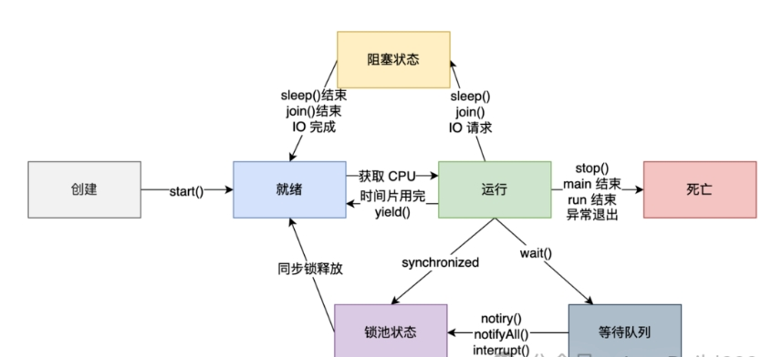

### 线程的状态
+ **NEW***(初始化状态) 创建thread对象,进行了初始化工作,这时的线程还没有被启动
+ **RUNNABLE**(可运行/运行状态) 代表它可能正处于运行状态,或者正在等待CPU资源的分配(从NEW -> RUNNABLE通过调用start方法)
+ **BLOCKED**(阻塞状态) 当线程进入`synchronized`方法/块或者调用`wait`后(被`notify`)重新进入`synchronized`方法/块,但是锁被其它线程占有,这个时候线程就会进入**BLOCKED**(阻塞)状态,这时候
  只有等到锁被另外一个线程释放,重新获取锁后,阻塞状态才会解除
+ **WAITING**(无限时等待) 这种状态不会自动切换为其它状态,是一种无限时状态,直到整个线程接收到了外界通知,去唤醒它,才会从**WAITING**转为**RUNNABLE**,下面三个方法会进入**WAITING**状态
  + `Object.wait()`: 使当前线程处于等待状态直到另一个线程唤醒它
  + `Thread.join()`: 等待线程执行完毕,底层调用的是`Object.wait`方法
  + `LockSupport.park()`: 除非获得调用许可,否则禁用当前线程进行线程调度
+ **TIMED_WAITING**(有限时等待) 是一种有限时的状态,可以通过设置等待时间,没有外界干扰的情况下,达到指定等待时间后,自动终止等待状态,转为**RUNNABLE**状态,调用如下方法会进入超时等待状态
  + `Thread.sleep(long millis)`: 使当前线程睡眠指定时间
  + `Object.wait(long timeout)`: 线程休眠指定时间,等待期间可以通过`notify()/notifyAll()`唤醒
  + `Thread.join(long millis)`: 等待当前线程最多执行millis毫秒,如果millis为0,则会一直等待
  + `LockSupport.parkNanos(long nanos)`: 除非获得调用许可,否则禁用当前线程进行线程调度在指定时间内
  + `LockSupport.parkUntil(long deadline)`: 同上,也是禁止线程进行调度指定时间
+ **TERMINATED**(终止状态) 线程正常执行结束,或者异常终止,会转变到**TERMINATED**状态

